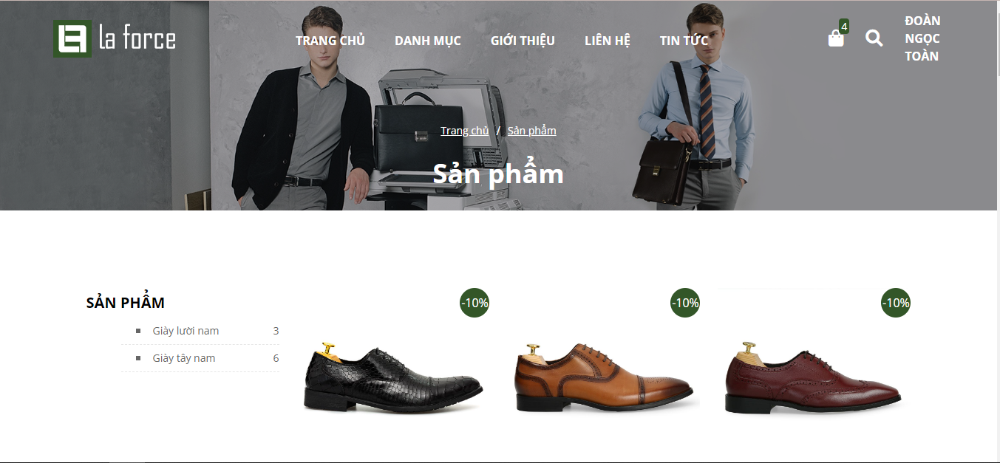

<p align="center"><a href="https://toannd.space/" target="_blank"></a></p>

## Tổng quan về dự án

Đây là một dự án website thương mại điện tử đơn giản, được xây dựng bằng ngôn ngữ PHP và framework Laravel. Website cung cấp các tính năng cơ bản của một trang mua sắm trực tuyến, bao gồm danh mục sản phẩm, trang chi tiết sản phẩm, giỏ hàng và thanh toán.

## Hướng dẫn cài đặt

Để cài đặt dự án, bạn cần có PHP và Composer trên máy tính của mình. Sau đó, bạn có thể thực hiện các bước sau:

1. Clone dự án từ GitHub: `git clone https://github.com/ngoctoan08/ecommerce-website-laravel.git`
2. Di chuyển vào thư mục dự án: `cd ecommerce-website-laravel`
3. Cài đặt các phụ thuộc: `composer install`
4. Tạo file .env và điền thông tin cấu hình cho ứng dụng (xem phần sau)
5. Tạo các bảng trong cơ sở dữ liệu: `php artisan migrate`
6. Chạy ứng dụng: `php artisan serve`

## Cấu hình file env
```
APP_NAME=Laravel
APP_ENV=local
APP_KEY=base64:eFMOfJO/2SglsI7M71cyA2M+VTx1KxsWmsqOgtTML3Y=
APP_DEBUG=true
APP_URL=http://127.0.0.1:8000

LOG_CHANNEL=stack
LOG_DEPRECATIONS_CHANNEL=null
LOG_LEVEL=debug

DB_CONNECTION=mysql
DB_HOST=127.0.0.1
DB_PORT=3306
DB_DATABASE=laravel-app
DB_USERNAME=root
DB_PASSWORD=

BROADCAST_DRIVER=log
CACHE_DRIVER=file
FILESYSTEM_DRIVER=local
QUEUE_CONNECTION=sync
SESSION_DRIVER=file
SESSION_LIFETIME=120

MEMCACHED_HOST=127.0.0.1

REDIS_HOST=127.0.0.1
REDIS_PASSWORD=null
REDIS_PORT=6379

MAIL_MAILER=smtp
MAIL_HOST=mailhog
MAIL_PORT=1025
MAIL_USERNAME=null
MAIL_PASSWORD=null
MAIL_ENCRYPTION=null
MAIL_FROM_ADDRESS=null
MAIL_FROM_NAME="${APP_NAME}"

AWS_ACCESS_KEY_ID=
AWS_SECRET_ACCESS_KEY=
AWS_DEFAULT_REGION=us-east-1
AWS_BUCKET=
AWS_USE_PATH_STYLE_ENDPOINT=false

PUSHER_APP_ID=
PUSHER_APP_KEY=
PUSHER_APP_SECRET=
PUSHER_APP_CLUSTER=mt1

MIX_PUSHER_APP_KEY="${PUSHER_APP_KEY}"
MIX_PUSHER_APP_CLUSTER="${PUSHER_APP_CLUSTER}"
```

## Sử dụng

- Sau khi cài đặt, bạn có thể truy cập vào trang chủ của website tại địa chỉ http://localhost:8000 để xem danh sách sản phẩm.
- Truy cập trang http://localhost:8000/admin/dashboard
username: local-user@gmail.com
password: localuser

## Các tài liệu liên quan

- **[Link mô hình CSDL](https://dbdiagram.io/d/63580dc4fa2755667d6f99d7)**
